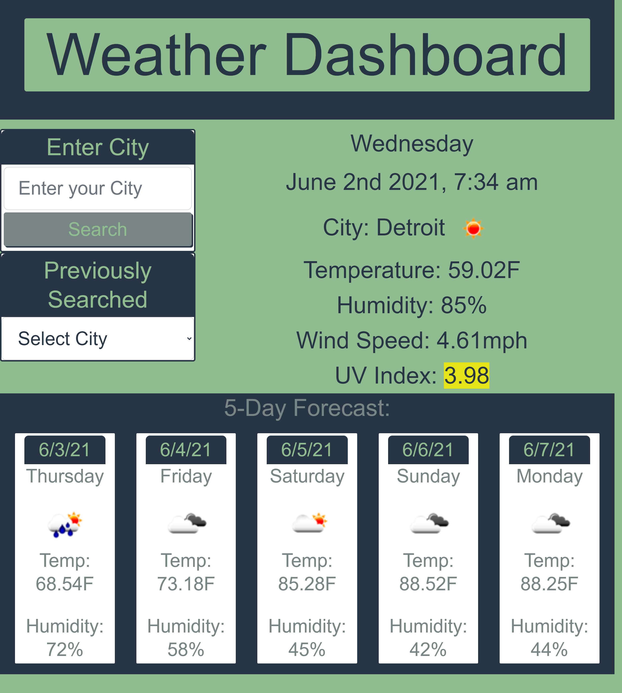

# Weather Dashboard

This weather dashboard provides current and future weather information for the city entered.  When a new city is searched, that city will be available as a button under "searched cities".  Only one button should render for each city.  The results displayed are city name, the date, an icon of weather conditions, the temperature, the humidity, the wind speed, and the UV index.  The UV index background color indicates the safety level for that level ranging in standard green to red rating system.  The five day forecast includes the date, temperature, weather consition icon and humidity.  For a new search, there is a "new search" button that will reset the page to ensure results do not accumulate and new buttons can be rendered before the next search. This dashboard uses Open Weather API and Moment to display current weather conditions and
future 5-day forecast in a user’s local area. This was styled with Bootstrap and was dynamically created using JQuery. This app is deployed as seen below is deployed at [kellyjohnson364.github.io/weather-dashboard](https://kellyjohnson364.github.io/weather-dashboard)

Email: KJ3641402@gmail.com
Linkedin: [linkedin.com/in/KellyJohnson364](https://www.linkedin.com/in/kelly-johnson-473227202)
